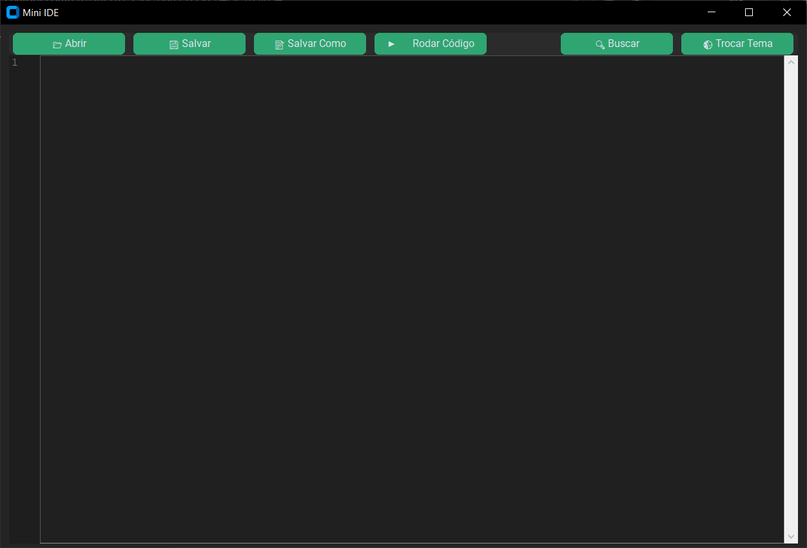

# 🧠 Mini IDE

Uma IDE **leve**, focada em **Python**, com as principais funcionalidades que você precisa pra escrever e rodar seus códigos rapidão — sem frescura.

> ⚠️ Em desenvolvimento: atualmente em versão de testes. Mas já funcional.

---

## ✨ Funcionalidades

- 📂 **Abrir arquivo** `.py`
- 💾 **Salvar** arquivo `.py`
- ▶️ **Rodar código** diretamente da interface
- 🔍 **Buscar** termos no código
- 🌗 **Trocar tema** (claro ou escuro)

---

## 📸 Interface

---

## ⬇️ Instalação

1. Vá até a aba [**Releases**](https://github.com/TUDIBR/Mini-IDE/releases)
2. Baixe o arquivo `.exe`
3. Execute. Pronto. Tá rodando! 🚀

---

## 🔑 Ativação por Key

Ao abrir a Mini IDE, será pedida uma **chave de acesso**.  
Procure pela key aqui: https://www.youtube.com/watch?v=aFID4UD7jLE

---

## 🌐 Requisitos

- Conexão com a internet
- Key válida

---

## 📜 Licença

Este software é protegido por **direitos autorais**.  
Você tem permissão para **usar o programa**, mas **não pode copiar, modificar ou redistribuir** nenhuma parte dele sem autorização do autor original.

Qualquer tentativa de alteração, engenharia reversa ou redistribuição sem permissão será considerada violação de direitos autorais.

**Autor original: TUDIBR**

---
